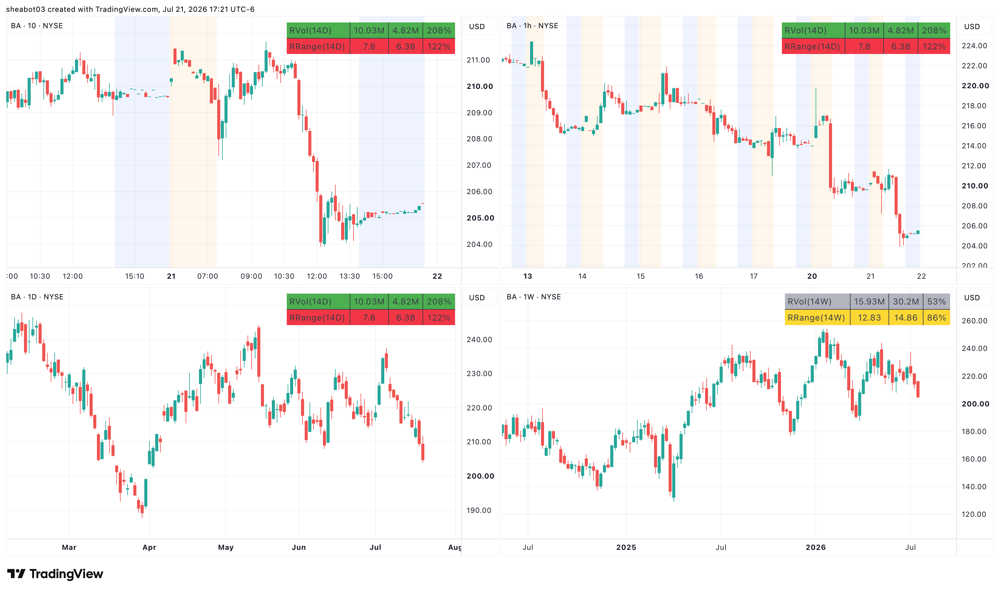

# Relative Volume and Range

Displays a combined table showing relative volume and relative range (also known as Daily True Range vs Average True Range) on all timeframes. The table rows change colors based on the relative volume and relative range values. The values and colors can be configured.

When the timeframe is 1D or less:
- The current volume is the volume for the day so far, and the average volume is calculated over the past bar length days.
- The current range is the difference between the high and low price since open, and the average true range (ATR) is calculated over the past bar length days.

When the timeframe is greater than 1D:
- The current volume is the volume for the past week/month/year so far, and the average volume is calculated over the past bar length weeks/months/years.
- The current range is the difference between the high and low price for the past week/month/year, and the average true range (ATR) is calculated over the past bar length weeks/months/years.

## Table Display

| Label       | Current Value | Average Value     | Relative Value     |
|-------------|---------------|-------------------|--------------------|
| RVol(14D)   | \<Volume>     | \<Average Volume> | \<Relative Volume> |
| RRange(14D) | \<DTR>        | \<ATR>            | \<Relative Range>  |

## Example

## Inputs

### Table Display

- Text Size
- Table Position

### Relative Volume

- Length
  - Bar length to calculate average volume
- Unusual Percent
  - Relative volume above this is considered unusual and the table row is colored `Unusual Color`.
- High Percent
  - Relative volume between this and `Unusual Percent` is considered high and the table row is colored `High Color`. Relative volume below this is considered low and the table row is colored `Low Color`.
- Unusual Color
- High Color
- Low Color

### Relative Range

- Length
  - Bar length to calculate average range
- High Percent
  - Relative range above this is considered high and the table row is colored `High Color`.
- Normal Percent
  - Relative range between this and `High Percent` is considered normal and the table row is colored `Normal Color`. Relative range below this is considered low and the table row is colored `Low Color`.
- High Color
- Normal Color
- Low Color

## Relative Volume

`Relative Volume = Current Volume / Average Volume * 100`

Relative Volume is a technical analysis tool that compares a stock's current trading volume to its average volume over a specified historical period. It helps traders identify unusual market activity and gauge the level of interest in a stock.

### Identifying High-Volume Breakouts

Relative Volume can help spot potential breakouts when the volume surges significantly above its average. High relative volume during a breakout suggests strong market interest and increasing the probability of a sustained move in the direction of the breakout.

### Confirming Trends and Reversals

Relative Volume can act as a confirmation tool for trends and reversals. A trend accompanied by rising relative volume indicates a strong and sustainable move. Conversely, a trend with declining relative volume might suggest a weakening trend or potential reversal.

### Spotting Volume Divergence

When the price is moving in one direction, but relative volume is declining or not confirming the move, then it may indicate a divergence. This discrepancy could suggest a potential reversal or trend change.

### Support and Resistance Confirmation

High relative volume near key support or resistance levels can indicate potential price reactions at those levels. This confirmation can be valuable in determining whether a level is likely to hold or break.

### Filtering Trade Signals

Incorporate relative volume into existing trading strategies as a filter. For example, consider taking trades only if relative volume is above a certain threshold, ensuring focus on high-impact trading opportunities.

### Avoiding Low-Volume Traps

Low relative volume can indicate a lack of interest or participation in the market. In such situations, price movements may be erratic and less reliable, so it's often wise to avoid trading during low relative volume periods.

### Monitoring News Events

Around significant news events or earnings releases, relative volume can help gauge the market's reaction to the information. High relative volume during such events can present trading opportunities, but be cautious of increased volatility and potential gaps.

### Adjusting Trade Size

During periods of extremely high relative volume, it might be prudent to adjust position size to account for higher risk.

### Morning Session

If relative volume in the first 15 to 30 minutes is already at 50% or 100%, then the stock will likely have very high relative volume by the end of the day. This provides conviction for trades.

## Relative Range

`Relative Range = Daily True Range (DTR) / Average True Range (ATR) * 100`

Relative Range is a technical analysis tool that compares a stock's Daily True Range (DTR) to its Average True Range (ATR) over a specified historical period. DTR represents the actual range traded so far today, while ATR provides the expected daily range based on historical data.

The Average True Range (ATR) measures the volatility of a stock over a specific timeframe. It provides insights into the price movement and potential price range of the stock. The ATR is calculated as the average of the true ranges over a specific number of periods. The true range is the greatest of the following three values:
- The difference between the current high and the current low.
- The absolute value of the difference between the current high and the previous close.
- The absolute value of the difference between the current low and the previous close.

It's important to note that the ATR is not a directional indicator like moving averages or oscillators. Instead, it provides a measure of volatility, helping traders adapt their strategies to suit the current market conditions.

### Risk Management

Traders and investors use ATR to assess the potential risk and reward of a stock. A higher ATR value indicates higher volatility and larger price movements, while a lower ATR value suggests lower volatility and smaller price movements. ATR can be used to help set stop-loss orders and profit targets, as it provides a dollar amount of a stock's average daily movement.

### Gauging Room to Move

Traders can use relative range to estimate how much more a stock might move within its typical daily range. If relative range is less than 100%, then it suggests that there might be more room for price movement. Conversely, if relative range is nearing or greater than 100%, then the stock might be approaching its typical daily exhaustion, making further breakouts less likely.

### Volatility Measurement

Both DTR and ATR are volatility indicators. ATR is particularly useful in volatile markets as it incorporates price gaps that other indicators might miss. High ATR values often follow sharp price moves, while low ATR values can indicate periods of consolidation.
